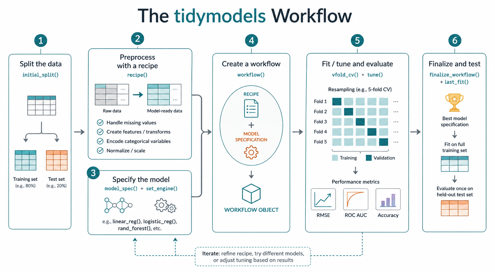

```{r}
#| message: false

library(tidymodels)
library(ISLR2) 
```

The `tidymodels` family of packages is a unified framework for machine learning in R. I recommend it for *predictive* modeling, where future performance is the primary benchmark for success. For descriptive modeling and statistical inference, `tidymodels` can be unwieldy.

## The `College` data set

Throughout this demonstration, I'll use the `ISLR2::College` data set, which includes information about 777 US colleges in 1995 [^1]. We'll view `Outstate` tuition as the response variable, attempting to model it using the other variables in the set. 

```{r}
glimpse(College)
```

The models shown below were chosen for clarity of presentation, and there are many places where different choices could lead to better performance. If you're serious about learning these tools, a helpful exercise would be to try beat the results shown at the end of this post.

## A model with no holdout set or CV split

R comes with several built-in modeling functions, including `lm()`. Many more are included in add-on packages like `glmnet`, `ranger`, etc. They syntax of these packages is highly inconsistent. 

The `parsnip` package, which loads with `tidymodels`, provides user-friendly wrapper functions for these tools, so in theory you don't have to learn a new package every time you learn a new modeling technique. The inputs and outputs have consistent structure, facilitating preprocessing, tuning, and evaluation. 

On the other hand, you can't just plug a model formula into something like `parsnip::linear_reg()` and get coefficients back, as you would with `lm()`.

```{r}
#| error: true

linear_reg(Outstate ~ Top10perc, 
           data = College) # Nope.
```

Instead, you specify the form of the model (below, just linear regression for now), then fit it separately using data.  

```{r}
my_lm <- linear_reg()

lm_fit <- fit(
  my_lm,
  Outstate ~ Top10perc + PhD,
  data = College
  )

lm_fit
```

This is awkward and underwhelming because the model is so simple and the `lm()` syntax so familiar. Most modern models require more fine-grained control. For instance, we might apply coefficient shrinkage to address model instability (don't worry if you don't know what this means yet). The syntax doesn't change much.

```{r}
enet <- linear_reg(
  mixture = .5, 
  penalty = 1, 
  engine = "glmnet"
  )

enet
```

The `engine`  argument identifies which function or package should be used to actually do the modeling. There are typically multiple options available. Here, I've specified an elastic net from the `glmnet` package.

By the way, when used directly, `glmnet` expects to be handed a separate model matrix and response vector. This workflow lets us ignore that potentially troublesome fact.

It's possible to immediately fit a model like the one above, but the output is specific to the engine and may not be immediately useful.

```{r}
enet_fit <- fit(
  enet,
  Outstate ~ Top10perc + PhD,
  data = College
  )

enet_fit 
```

The `broom::tidy` function is your friend if you want model coefficients and p-values.

```{r}
#| message: false

tidy(lm_fit)
tidy(enet_fit)
```

You can make predictions using `predict()`.

```{r}
new_data = data.frame(
  Top10perc = c(20, 30, 40),
  PhD = c(70, 60, 80),
  Outstate = c(10000, 15000, 17000)
  )

predict(enet_fit, new_data)
```

While nice, none of this is really worth the overhead of learning `tidymodels`. The primary advantage of the above workflow is the ease with which we can add data splitting, preprocessing, parameter tuning, and model evaluation. 

## Machine learning with `tidymodels`

The `tidymodels` framework starts to shine when we use it for machine learning, where future performance of the model is prioritized over interpretability or statistical inference.



When using data to estimate the future performance of a model, we always adhere to one essential core principle, which `tidymodels` works hard to enforce:

$$
\text{\textbf{Do not use the same data to both train and assess any model.}}
$$

At the start of the modeling process, then, we set aside a fraction of our observations (usually 20% or 25%) for final evaluation, using the remaining ones for model building. Additional splits are often needed when the model is being tuned. More on this later.

## Splitting the data

The `rsample::initial_split()` function partitions a data set by randomly assigning rows (`prop = 3/4` is the default) to the training set and storing them, along with the full data frame, in a list (technically, an `rsplit` object).

```{r}
set.seed(0)

split <- initial_split(College)
split
names(split)
split$in_id |> head(n = 20)
```

The training set, then, is `split$data[split$in_id, ]`, though `tidymodels` provides simple functions to extract both the training and test sets. 

```{r}
train <- training(split)
test <- testing(split)

glimpse(train) # 582 rows, ~75% of the original set
```

We could also consider stratifying the split by the response variable. If the response is quantitative, as is the case here, `initial_split()` will automatically group it into quartiles.

```{r}
#| eval: false

split <- initial_split(
  College, 
  strata = Outstate
  )
```

One advantage to retaining the `rsplit` object rather than just creating `train` and `test` directly (for instance with `slice_sample` and `anti_join`) is that `tidymodels` will later allow us to effortlessly apply model assessment functions to the `split` object itself.

For now we leave the test set aside and build the model entirely using `train`.

## Specifying the model

It's time to decide how we'll model the data. Let's start with a simple $k$-nearest neighbor regression, where the closest points to a new observation are used to estimate an unknown response value. For this, we use `parsnip::nearest_neighbor()`.

To start, we can just choose a reasonable value for the number of neighbors. Sometimes $k = \sqrt{n}$ is recommended, so we pick a value close to that. Later, we should consider whether other values might give better results.

```{r}
my_knn <- nearest_neighbor(
  mode = "regression",
  engine = "kknn",
  neighbors = 27
  )
```

In this case, `kknn::kknn()` is the default engine; I've included the argument for consistency and clarity. 

The `mode` of the model is typically either "regression" for a quantitative response or "classification" for a nominal one. In general, `tidymodels` will guess appropriately, so this argument is often optional as well. 

## Preprocessing

Because a knn model will judge "nearest" using Pythagorean distance, it will be sensitive to the scale of the variables in the data set. Values measured in cents will appear 100 times farther apart than values measured in dollars, for instance. 

For this reason, it's considered best-practice to standardize all variables before fitting a knn model. This is a simple form of *preprocessing*, transforming existing variables to obtain something more amenable to the chosen modeling technique. While such work can be done directly with `dplyr`, there is a better way. 

A *recipe*, as the name suggests, is a documented set of steps to be followed when any data (training, test, or otherwise) is handled by a model. Storing our steps in this way allows us to automate the process so that it be easily applied as needed. 

Let's create a simple recipe appropriate to a knn model. 

```{r}
col_rec <- recipe(Outstate ~ ., data = train) |> 
  step_dummy(all_nominal_predictors()) |> 
  step_normalize(all_numeric_predictors())
```

Preprocessing tools generally have the form `step_*()`. Most common techniques have built-in functions, including the two used above. 

- `step_dummy()` encodes the specified categorical variables (here, all categorical explainers) as dummy variables. While some modeling functions (including our old friend `lm`) do this automatically, `tidymodels` requires that we be explicit. 

- `step_normalize()` converts values to $z$-scores using the sample mean and standard deviation from the training set, placing them onto a common scale.

These are two common and important preprocessing tools. There are many more, including ones that perform *feature engineering*, extracting important information that may not be captured directly by existing variables. For instance, in a set that includes dates, the day of the week may the most relevant aspect. This can be extracted with `step_date()`.

Just as `tidymodels` requires us to explicitly encode factor variables for numerical models, so does it require us to engage with missing values. This extra step is a very good thing, as it prevents us from casually dropping incomplete observations wholesale. `NA`s can be converted to an "unknown" category with `step_unknown()` or replaced with reasonable values using one of the various `step_impute_*()` functions.

In a moment, we'll integrate our recipe directly into our modeling workflow. First, though, let's consider what we already have.

You may have noticed that some steps (including `step_normalize`) require input from the training set. Currently the recipe, which is just a set of instructions, has not performed any such computations. Use `prep()` to tell `tidymodels` to incorporate the training data into the recipe.

```{r}
rec_prepped <- prep(col_rec)
rec_prepped
```

The word "Trained" in the output refers to the *recipe*, not the overall model. For instance, our output indicates that $z$-scores have been computed using $\overline{x}$ and $s$ from the training set, where previously only the instruction to do so had existed. 

Once the recipe is trained (prepped), it can be applied to any set with the correct column names, including `train` and `test`. For instance, the next chunk outputs a data frame showing the results of applying the recipe directly to the training set

```{r}
train_baked <- bake(
  rec_prepped,
  new_data = train
  )

glimpse(train_baked)
```

If we were to `bake` a recipe using some other `new_data`, $z$-scores would still be computed using means and standard deviations from the training set. 

In general, you only need `prep()` and `bake()` if you want to explicitly see the transformed predictors. More typically, we just incorporate the preprocessor directly into a `tidymodels` workflow.

## Creating a workflow

A `workflow` incorporates both a recipe and a model specification. 

```{r}
knn_wf <- workflow(
  preprocessor = col_rec,
  spec = my_knn
  )
```

Often, you'll see this step written using the pipe.

```{r}
#| eval: false

knn_wf <- workflow() |> 
  add_recipe(col_rec) |> 
  add_model(my_knn) # same as before
```

It's common in `tidymodels` to pipe various model objects, connecting them like pieces of a `ggplot` call. For instance, a model is often specified like this:

```{r}
#| eval: false

my_knn <- nearest_neighbor() |> 
  set_engine("kknn") |> 
  set_mode("regression") # same as before
```

This may feel awkward if you're used to only piping data sets. You get past that quickly, I promise.

A `workflow` is a combined set of instructions for fitting a model to data. It says how to preprocess that data and constructs an algorithm for making predictions on new observations. Importantly, it does **not** actually execute any of those steps, still putting off the fitting process.

```{r}
knn_wf
```

We can take this next step using the `fit()` function, which we've seen before.

```{r}
knn_wf_fit <- fit(
  knn_wf, 
  data = train
  )
```

The model is now ready to use.

## Putting a trained workflow into action

Use `predict()` to make predictions, duh. To start, we might just look at the training set, checking how far actual results are from the model's predictions. The output is a tibble, not a vector.

```{r}
predict(
  knn_wf_fit, 
  new_data = train
  )
```

Predictions made on the same data used to train the model will almost always be overly optimistic. It's like when your mom tells you that you look nice. 

## Evaluation using the test set

Once we've finalized our model, we can check its performance on the holdout set. 

Warning! Using the results of this check to tweak the model would invalidate the point of the testing set, which is to give a measure of performance independent from the training data. In general, you shouldn't do it. 

The `broom::augment()` function makes this information readily available in a data frame that includes all the variables relevant to the model.

```{r}
test_aug <- augment(
  knn_wf_fit, 
  new_data = test
  )

glimpse(test_aug)
```

The `yardstick` package, included in `tidymodels,` consists of dedicated functions for computing standard performance metrics, including root mean squared error and $R^2$. There are dozens of such functions available, all with consistent syntax. See the package index file for a complete list.

```{r}
rmse(test_aug, 
     truth = Outstate,
     estimate = .pred)
```

You can compute multiple performance metrics at once by creating a *metric set*.

```{r}
my_metrics <- metric_set(rmse, rsq)

my_metrics(
  test_aug,
  truth = Outstate, 
  estimate = .pred
  )
```

The fact that these outputs are tibbles will be very convenient once we begin comparing various models. 

## Model tuning and cross validation

It's unlikely that our choice of $k=27$ neighbors was optimal. *Model tuning* refers to the process of considering a range of hyperparameter values and selecting the best one. `tidymodels` is built to facilitate it. 

We start by specifying within our model that a hyperparameter needs to be tuned. We do this with the `tune()` placeholder.

```{r}
my_knn_cv <- nearest_neighbor(
  mode = "regression",
  engine = "kknn",
  neighbors = tune()
  )

knn_wf_cv <- workflow(
  preprocessor = col_rec,
  spec = my_knn_cv
  )
```

The most common way of comparing competing models during the tuning process is using *cross-validation*, where the training set is split into pieces (often $v=10$) of approximately equal size, called *folds*. The models are all then trained once per fold, with that one fold used as a holdout set while the others are used for training. The $v$ results (measured using rmse or some other metric) are then averaged to give performance estimates for each of the competing models.

We create the cross validation split using `rsample::vfold_cv()`. The output is a tibble with one row per fold. 

```{r}
folds <- vfold_cv(
  train, 
  v = 10,
  repeats = 5)

head(folds)
```

The `repeats` argument indicates that the 10-fold split should be done 5 separate times, meaning that we're about to fit our model 50 times as part of our tuning process. This may become time-consuming, even on a modern computer. While repeats aren't strictly required, using them reduces the variance (uncertainty) of the cross-validation result. 

The simplest tool to perform model fitting on cross-validation folds is `tune_grid()`.

```{r}
#| eval: false

tune_results <- tune_grid(
  knn_wf_cv,
  resamples = folds
  )
```

This function operates by brute force using a default set of 10 values that make sense for the hyperparameter being tuned. Often, you'll want to tweak these values using the optional `grid` argument. You can either pass this as a data frame of parameter values or a `dials` object such as the one created by the `neighbors()` function. For this simple example, let's use the first method.

```{r}
neighbors <- seq(11, 33, by = 2)
knn_grid <- data.frame(neighbors)
knn_grid

tune_results <- tune_grid(
  knn_wf_cv,
  resamples = folds,
  grid = knn_grid
  )

glimpse(tune_results)
```

The result is a mutated version of the output of `vfold_cv()` that includes new columns for `.metrics` and `.notes`. The first of these includes rmse and $R^2$ for each parameter value on each fold. If you'd like to specify different measures of fit, create a metric set and use the optional `metrics` argument in `tune_grid()`. 

While it's possible to drill down into the `tune_results()` object directly (it's just a tibble, after all), you'll usually want to either compare the overall performance of various hyperparameter values or just grab the best one directly. Use `collect_metrics()` to accomplish the former.

```{r}
tuning_metrics <- collect_metrics(tune_results)
tuning_metrics
```

It's often helpful to plot tuning results:

```{r}
tuning_metrics |> 
  filter(.metric == "rmse") |> 
  ggplot(aes(x = neighbors, y = mean)) + 
  geom_line() +
  geom_point() +
  theme_minimal()
```

Use `show_best()` to automatically filter out sub-optimal rows from `tuning_metrics`. By default, the best 5 are shown, though this can be controlled with the optional `n` argument.

```{r}
show_best(
  tune_results,
  metric = "rmse",
  n = 7
  ) 
```

To automatically extract the result that minimizes rmse (or any other metric), use `select_best()`. 

```{r}
optimal_k <- select_best(
  tune_results,
  metric = "rmse"
  )

optimal_k # 23 neighbors
```

`select_best()` has several friends, including `select_by_one_std_error()`, which chooses the least flexible model with performance comparable to the optimal one. 

The output of `select_best()` can be fed back to the workflow being tuned with `finalize_workflow()`. 

```{r}
knn_wf_final <- finalize_workflow(
  knn_wf_cv,
  optimal_k
  )

knn_wf_final
```

The model is now fully specified.

## Evaluating performance

We can incorporate training data into our finalized model with `fit()`. The output can be saved and applied to new data with `predict()`. 

```{r}
knn_final <- fit(
  knn_wf_final, 
  data = train
  )

predict(
  knn_final, 
  new_data = test
  )
```

If all you want to do is apply the trained model to the holdout set created with `initial_split()`, use `last_fit()`. To extract performance metrics from this object, use `collect_metrics()`. 

```{r}
last_fit(knn_wf_final, split) |>
  collect_metrics()
```

On average, this model misses the true out-of-state tuition by about $1904.

## What's next?

This post barely scratches the surface, despite its length. If you've made it this far, you might be itching to compare the performance of other models (like neural networks, for instance) or alternative preprocessing steps. This can be done with a `workflow_set`. Or you might want to speed up the tuning process, either by using a less brute-force approach from the `tune` package, most notably `tune_Bayes()`, or by implementing parallel processing for the calculations using the `future` package.  

## Final thought

If you were expecting that learning `tidymodels` would be like learning `tidyverse`, you're probably disappointed right about now. While you can practice `dplyr` without touching `ggplot2`, you can't meaningfully do this with the individual `tidymodels` packages. This isn't a design flaw in `tidymodels` but rather a fundamental challenge of the machine learning process, which is interconnected and complex by its very nature. 

Overall, `tidymodels` is as about as simple as it can be while still doing what it does. Be patient with yourself, take multiple passes at the content, and you'll get there sooner than you think.

[^1]: James, G., Witten, D., Hastie, T., & Tibshirani, R. (2021). *An introduction to statistical learning: with applications in R* (Vol. 2). <https://www.statlearning.com/>