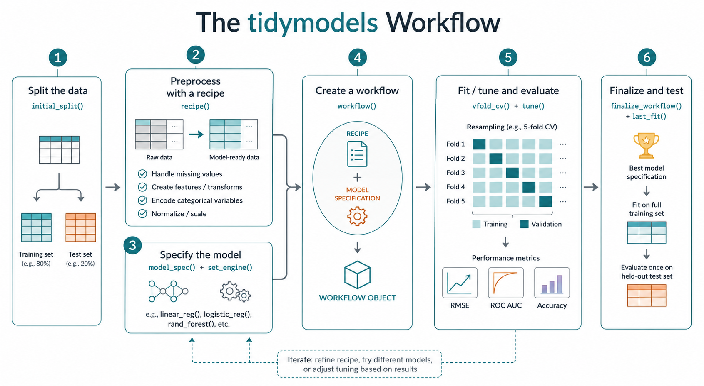

```{r}
#| message: false

library(tidymodels)
library(ISLR2) 
```

The `tidymodels` family of packages is a unified framework for machine learning in R. I recommend it for *predictive* modeling, where future performance is the primary benchmark for success. For descriptive modeling and statistical inference, `tidymodels` can be unwieldy.



When using data to estimate the future performance of a model, we always adhere to one essential core principle, which `tidymodels` works hard to enforce: *Never  use the same data to both train and assess any model.*

## The `College` data set

Throughout this demonstration, I'll use the `ISLR2::College` data set, which includes information about 777 US colleges in 1995. We'll view `Outstate` tuition as the response variable, attempting to model it using the other variables in the set. 

```{r}
glimpse(College)
```

## Splitting the data

The `rsample::initial_split()` function partitions a data set by randomly assigning rows (`prop = 3/4` is the default) to the training set and storing them, along with the full data frame, in a list (technically, an `rsplit` object).

```{r}
set.seed(0)

split <- initial_split(College)
split
names(split) 
split$in_id |> head(n = 20) # Training set row numbers
```

`tidymodels` provides simple functions to extract both the training and testing sets. 

```{r}
train <- training(split)
test <- testing(split)

glimpse(train) # 582 rows, ~75% of the original set
```

We could also consider stratifying the split by the response variable. If the response is quantitative, as is the case here, `initial_split()` will automatically group it into quartiles.

```{r}
#| eval: false

split <- initial_split(
  College, 
  strata = Outstate
  )
```

We now leave the test set aside and build the model entirely using `train`.

## Specifying the model

`tidymodels` distinguishes between model *specification*, where we make choices about how the data will be modeled, and *fitting*, where training data is used to construct a concrete algorithm for making predictions. 

If you're used to base R modeling functions like `lm()`, this may feel awkward at first.

```{r}
#| error: true

lm(
  Outstate ~ Top10perc  + PhD, 
  data = College
  ) # standard

linear_reg(
  Outstate ~ Top10perc  + PhD,
  data = College
  ) # fails
```

The `tidymodels` code to obtain regression coefficients is somewhat more verbose.

```{r}
my_lm <- linear_reg() # parsnip specification

my_lm_fit <- fit(
  my_lm,
  Outstate ~ Top10perc + PhD,
  data = College
  ) # fit the model

my_lm_fit
tidy(my_lm_fit) # results as a tibble
```

This is underwhelming because the model is so simple and the `lm()` syntax so familiar.

Let's switch to a modestly more complicated $k$-nearest neighbor regression, where the closest points to a new observation are used to estimate an unknown response value. For this, we use `parsnip::nearest_neighbor()`.

```{r}
my_knn <- nearest_neighbor(
  mode = "regression",
  engine = "kknn",
  neighbors = 27 # a reasonable first choice
  )

my_knn
```

Fitting this model immediately would give sub-optimal results, however, as the data set is not yet in an appropriate form for knn regression. 

## Preprocessing

A *recipe*, as the name suggests, is a documented set of steps to be followed when any data (training, test, or otherwise) is handled by a model. Storing our steps in this way allows us to automate the process so that it be easily applied as needed. 

Let's create a simple recipe appropriate to a knn model. 

```{r}
col_rec <- recipe(
  Outstate ~ ., data = train) |> 
  step_dummy(all_nominal_predictors()) |> 
  step_normalize(all_numeric_predictors())

col_rec
```

Preprocessing tools generally have the form `step_*()`. Most common techniques have built-in functions, including the two used above. 

You may have noticed that some steps (including `step_normalize`) require input from the training set. Currently the recipe, which is just a set of instructions, has not performed any such computations. Use `prep()` to tell `tidymodels` to incorporate the training data into the recipe.

```{r}
rec_prepped <- prep(col_rec)
rec_prepped
```

Once the recipe is trained (prepped), it can be applied to any set with the correct column names, including `train` and `test`.

```{r}
train_baked <- bake(
  rec_prepped,
  new_data = train
  )

glimpse(train_baked)
```

In general, you only need `prep()` and `bake()` if you want to explicitly see the transformed predictors. More typically, we just incorporate the preprocessor directly into a `tidymodels` workflow.

## Creating a workflow

A `workflow` incorporates both a recipe and a model specification. 

```{r}
knn_wf <- workflow(
  spec = my_knn,
  preprocessor = col_rec,
  )
```

Often, you'll see this step written using the pipe.

```{r}
#| eval: false

knn_wf <- workflow() |> 
  add_recipe(col_rec) |> 
  add_model(my_knn) # same as before
```

Importantly, creating a `workflow` does **not** actually perform any preprocessing or model fitting.

```{r}
knn_wf
```

We can take this next step using the `fit()` function.

```{r}
knn_wf_fit <- fit(
  knn_wf, 
  data = train
  )
```

The model is now ready to use.

## Putting a trained workflow into action

Use `predict()` to make predictions, duh. To start, we might just look at the training set, checking how far actual results are from the model's predictions. The output is a tibble, not a vector.

```{r}
predict(
  knn_wf_fit, 
  new_data = train
  )
```

Predictions made on the same data used to train the model will almost always be overly optimistic. It's like when your mom tells you that you look nice. 

## Model tuning and cross validation

It's unlikely that our choice of $k=27$ neighbors was optimal. *Model tuning* refers to the process of comparing a range of hyperparameter values and selecting the best one. `tidymodels` is built to facilitate this. 

We start by specifying within our model that a hyperparameter needs to be tuned. We do this with the `tune()` placeholder.

```{r}
my_knn_cv <- nearest_neighbor(
  mode = "regression",
  engine = "kknn",
  neighbors = tune()
  )

knn_wf_cv <- workflow(
  preprocessor = col_rec,
  spec = my_knn_cv
  )
```

The most common way of comparing competing models during the tuning process is using *cross-validation*, where the training set is split into pieces (often $v=10$) of approximately equal size, called *folds*. The models are all then trained once per fold, with that one fold used as a holdout set while the others are used for training. The $v$ results are then averaged to give performance estimates for each of the competing models.

```{r}
folds <- vfold_cv(
  train, 
  v = 10,
  repeats = 5) # create folds

head(folds)
```

The simplest tool to perform model fitting on cross-validation folds is `tune_grid()`.

```{r}
#| eval: false

tune_results <- tune_grid(
  knn_wf_cv,
  resamples = folds
  )
```

This function operates by brute force using a default set of 10 values that make sense for the hyperparameter being tuned. You can tweak these values by passing new ones within a data frame.

```{r}
neighbors <- seq(11, 33, by = 2)
knn_grid <- data.frame(neighbors)
knn_grid

tune_results <- tune_grid(
  knn_wf_cv,
  resamples = folds,
  grid = knn_grid
  )
```

Another option for modifying the tuning grid is to use one of the dedicated functions from the `dials` package. 

```{r}
glimpse(tune_results)
```

The result of `tune_grid()` is a mutated version of the output of `vfold_cv()` that includes new columns for `.metrics` and `.notes`. 

Use `collect_metrics()` to compare performance across parameter values.

```{r}
tuning_metrics <- collect_metrics(tune_results)
tuning_metrics
```

It's often helpful to plot these results.

```{r}
tuning_metrics |> 
  filter(.metric == "rmse") |> 
  ggplot(aes(x = neighbors, y = mean)) + 
  geom_line() +
  geom_point() +
  theme_minimal()
```

Use `show_best()` to automatically filter out sub-optimal rows from `tuning_metrics`. By default, the best 5 are shown, though this can be controlled with the optional `n` argument.

```{r}
show_best(
  tune_results,
  metric = "rmse",
  n = 7
  ) 
```

To automatically extract the result that minimizes rmse (or any other metric), use `select_best()`. 

```{r}
optimal_k <- select_best(
  tune_results,
  metric = "rmse"
  )

optimal_k # 23 neighbors
```

`select_best()` has several friends, including `select_by_one_std_error()`, which chooses the least flexible model with performance comparable to the optimal one. 

The output of `select_best()` can be fed back to the workflow being tuned with `finalize_workflow()`. 

```{r}
knn_wf_final <- finalize_workflow(
  knn_wf_cv,
  optimal_k
  )

knn_wf_final
```

The model is now fully specified and ready to be fit using the training set.

```{r}
knn_fit_final <- fit(
  knn_wf_final, 
  data = train)
```

## Evaluation using the test set

Once we've finalized our model, we can use it to make predictions on new data. The `broom::augment()` function makes this information readily available in a data frame that includes all the variables relevant to the model.

```{r}
test_aug <- augment(
  knn_fit_final, 
  new_data = test
  )

glimpse(test_aug)
```

The `yardstick` package, included in `tidymodels,` consists of functions which compute standard performance metrics, including root mean squared error.

```{r}
rmse(test_aug, 
     truth = Outstate,
     estimate = .pred)
```

You can compute multiple performance metrics at once by creating a *metric set*.

```{r}
my_metrics <- metric_set(rmse, rsq)

my_metrics(
  test_aug,
  truth = Outstate, 
  estimate = .pred
  )
```

The fact that these outputs are tibbles will be very convenient once we begin comparing various models. 

If all you want to do is apply the trained model to the holdout set created with `initial_split()`, use `last_fit()`. To extract performance metrics from this object, use `collect_metrics()`. 

```{r}
last_fit(knn_wf_final, split) |>
  collect_metrics()
```

On average, this model misses the true out-of-state tuition by about $1904.

## Final thought

If you were expecting that learning `tidymodels` would be like learning `tidyverse`, you're probably disappointed right about now. While you can practice `dplyr` without touching `ggplot2`, you can't meaningfully do this with the individual `tidymodels` packages. This isn't a design flaw in `tidymodels` but rather a fundamental challenge of the machine learning process, which is interconnected and complex by its very nature. 

Overall, `tidymodels` is as about as simple as it can be while still doing what it does. Be patient with yourself, take multiple passes at the content, and you'll get there sooner than you think. 
  
  
  